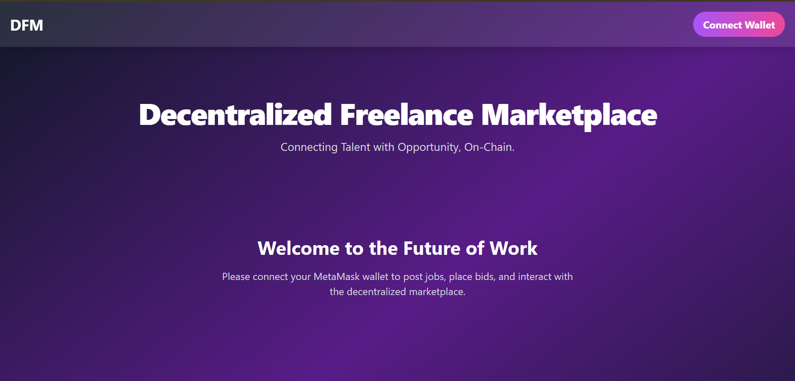
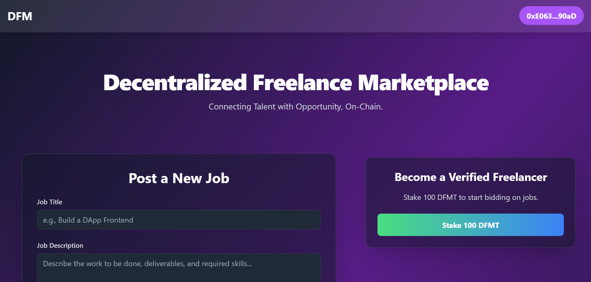
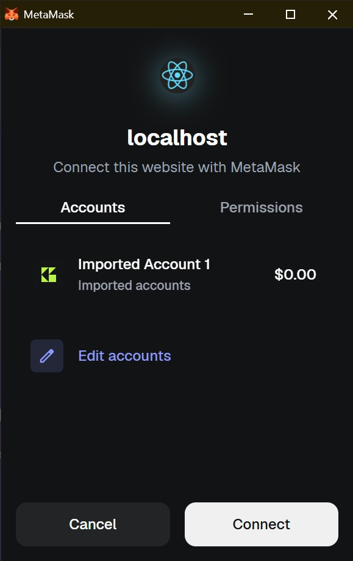

# Decentralized Freelance Marketplace (DFM)

A fully decentralized freelance marketplace built on the Ethereum blockchain. Inspired by platforms like Upwork and Fiverr, this DApp removes the middleman, ensuring transparent, secure, and automated transactions through smart contracts. It features on-chain escrow, freelancer staking, and a foundation for DAO governance.

## Screenshots





## Key Features

- Wallet-Based Identity: No email/password required. Connect with MetaMask.
- On-Chain Job Posting: Clients can post jobs with budgets directly to the smart contract.
- Secure Escrow System: Job payments are locked in a smart contract and released only upon job completion.
- Freelancer Staking: Freelancers stake platform tokens (DFMT) to bid on jobs, ensuring commitment and reducing spam.
- Bidding System: Staked freelancers can place bids on open jobs.
- Client Controls: Clients can view all bids on their jobs and select the best freelancer.
- DAO Foundation: A basic DAO contract is in place for future governance and dispute resolution.
- IPFS Integration: Job details are stored off-chain on IPFS for cost efficiency, with only the hash stored on-chain.
- Modern UI: A beautiful, responsive frontend built with React and Tailwind CSS, featuring animations and a professional look.

## Tech Stack

| Category                  | Technologies                          |
|---------------------------|---------------------------------------|
| Blockchain                | Solidity, Ethereum (Ganache for local development) |
| Smart Contract Development| Hardhat, Ethers.js, OpenZeppelin      |
| Frontend                  | React.js, Tailwind CSS                |
| Wallet                    | MetaMask                              |
| Off-Chain Storage         | IPFS with Pinata for pinning          |
| Testing                   | Mocha, Chai                           |

## Architecture Overview

```
Frontend (React + Ethers.js) -> MetaMask (Wallet Connection) -> Smart Contracts (JobManager, Escrow, etc.) -> Ethereum Network (Ganache) -> IPFS (Metadata Storage)
```

## Getting Started (Local Setup)

This guide will help you set up and run the project locally.

### Prerequisites

- Node.js (v18 or later)
- MetaMask browser extension
- Ganache desktop application

### Installation & Setup

1. Clone the repository:
   ```bash
   git clone https://github.com/raushan728/decentralized-freelance-marketplace.git
   cd decentralized-freelance-marketplace
   ```

2. Install backend dependencies:
   ```bash
   npm install
   ```

3. Install frontend dependencies:
   ```bash
   cd frontend
   npm install --legacy-peer-deps
   cd ..
   ```

### Environment Configuration (Important!)

This project requires you to create your own environment files for secret keys. These files are not and should not be committed to GitHub.

1. Pinata API Keys:
   - Go to [Pinata.cloud](https://pinata.cloud), create a free account, and generate an API key.
   - In the `frontend` folder, create a new file named `.env`.
   - Add your Pinata keys to this file like this:
     ```
     REACT_APP_PINATA_API_KEY=Your_Pinata_API_Key
     REACT_APP_PINATA_API_SECRET=Your_Pinata_API_Secret
     ```

2. Ganache Private Key:
   - Open your Ganache application.
   - Copy the private key from one of the accounts (by clicking the key icon).
   - Open the `hardhat.config.js` file in the project root.
   - Find the `accounts` array inside the `ganache` network configuration and paste your private key there.
     ```javascript
     networks: {
       ganache: {
         url: "http://127.0.0.1:7545",
         accounts: [
           "YOUR_GANACHE_PRIVATE_KEY_HERE"
         ]
       }
     }
     ```

### Running the Application

1. Compile the smart contracts:
   ```bash
   npx hardhat compile
   ```

2. Deploy the contracts to your local Ganache network:
   ```bash
   npx hardhat run scripts/deployAll.js --network ganache
   ```

3. Update Frontend with New Addresses:
   - After running the deploy script, your terminal will show a "Deployment Summary" with the new contract addresses.
   - Copy these new addresses.
   - Go to `frontend/src/constants/contractInfo.js`.
   - Paste the new addresses in the corresponding variables at the bottom of the file.

4. Start the frontend application:
   ```bash
   cd frontend
   npm start
   ```
   Your DApp should now be running on `http://localhost:3000`!
